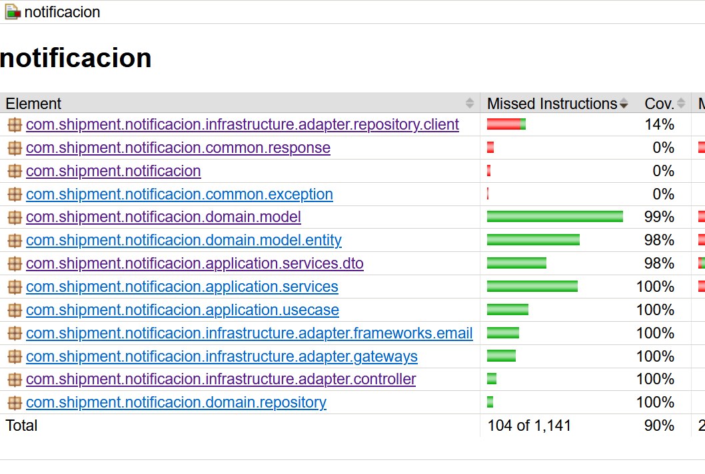

# Notificador de retrasos de envio de paqueteria por mal tiempo

Esta aplicación consulta estado del tiempo en la localizacion del comprador, notifica al comprador de posibles retrasos en la entrega del paquete y guarda el registro de notificacion.

Este documento proporciona las instrucciones necesarias para construir la imagen Docker y lanzar la aplicación de Notificación de Envíos utilizando los archivos `Dockerfile` y `docker-compose.yml` ya existentes en este proyecto.

## Prerrequisitos

Asegúrate de tener instalado lo siguiente en tu sistema:

* **Docker:** [https://docs.docker.com/get-docker/](https://docs.docker.com/get-docker/)
* **OpenJDK 21:** [https://www.azul.com/downloads/?version=java-21-lts&os=linux](https://www.azul.com/core-post-download/?endpoint=zulu&uuid=1632da4f-1d58-4757-873e-ea928c4c6e01/)

## Pasos para Construir la Imagen y Lanzar el Contenedor

1. ### Construir la aplicación:

Clonar este repositorio e ir al directorio raíz del proyecto en tu terminal donde se encuentra el codigo fuente y ejecuta

```bash
gradlew clean build
```
El sistema inicia a compilar el código fuente y ejecutar las pruebas unitarias. Luego crear el archivo jar en la
ruta:

```bash
build->libs->notificacion-0.0.1-SNAPSHOT.jar.
```

#### Reporte de pruebas unitarias y Cobertura

El reporte de pruebas unit test esta en

```bash
build/reports/tests/test/index.html
```
El reporte de Cobertura contiene el 90% y se encuentra en la ruta

```bash
build/reports/jacoco/test/html/index.html
```



2. ### Construir la Imagen Docker de la Aplicación:

Ir al directorio raíz del proyecto en tu terminal (donde se encuentra el `Dockerfile`) y ejecuta el siguiente comando para construir la imagen Docker:

```bash
docker build -t delivery-app-image .
```

3. ### Configurar las Variables de Entorno en docker-compose.yml:

Abre el archivo docker-compose.yml en la raíz del proyecto y asegúrate de configurar las siguientes variables de entorno dentro del servicio delivery-app en la sección environment:
```YAML

version: '3.8'

services:
  delivery-db:
    image: postgres:15-alpine
    container_name: delivery-db
    environment:
      POSTGRES_USER: postgres
      POSTGRES_PASSWORD: "12345678"
      POSTGRES_DB: delivery
    ports:
      - "5432:5432"
    volumes:
      - delivery_data:/var/lib/postgresql/data
    healthcheck:
      test: ["CMD-SHELL", "pg_isready -U postgres -d delivery"]
      interval: 5s
      timeout: 5s
      retries: 5

  delivery-app:
    container_name: delivery-app
    build:
      context: .
      dockerfile: Dockerfile
    ports:
      - "8080:8080"
    environment:
      SERVER_PORT: 8080
      SPRING_APPLICATION_NAME: notificacion-de-envios
      SPRING_LOGGING_LEVEL_ROOT: INFO
      SPRING_LOGGING_LEVEL_REACTOR_NETTY: OFF
      SPRING_R2DBC_SCRIPTS_SCHEMA: classpath:schema.sql
      SPRING_R2DBC_URL: r2dbc:pool:postgresql://delivery-db:5432/delivery
      SPRING_R2DBC_USERNAME: postgres
      SPRING_R2DBC_PASSWORD: "12345678"
      SPRING_MAIL_HOST: smtp.gmail.com
      SPRING_MAIL_PORT: 587
      SPRING_MAIL_USERNAME: tu_correo_de_gmail@gmail.com  # Reemplaza con tu correo
      SPRING_MAIL_PASSWORD: tu_contraseña_de_aplicación_de_16_dígitos # Reemplaza con tu contraseña de aplicación
      SPRING_MAIL_PROPERTIES_MAIL_SMTP_AUTH: "true"
      SPRING_MAIL_PROPERTIES_MAIL_SMTP_STARTTLS_ENABLE: "true"
      SPRING_WEBFLUX_PROBLEMDETAILS_ENABLED: "true"
      MANAGEMENT_ENDPOINT_HEALTH_ENABLED: "true"
      MANAGEMENT_ENDPOINT_HEALTH_SHOW_DETAILS: never
      MANAGEMENT_ENDPOINT_HEALTH_PROBES_ENABLED: "true"
      MANAGEMENT_ENDPOINTS_WEB_EXPOSURE_INCLUDE: health,liveness,readiness
      MANAGEMENT_ENDPOINTS_WEB_BASE_PATH: /
      MANAGEMENT_ENDPOINTS_WEB_PATH_MAPPING_HEALTH: health
      MANAGEMENT_ENDPOINTS_WEB_PATH_MAPPING_LIVENESS: liveness
      MANAGEMENT_ENDPOINTS_WEB_PATH_MAPPING_READINESS: readiness
      WEATHER_KEY: tu_api_key_weatherapi # Reemplaza con tu API key de WeatherAPI
      WEATHER_SERVER: [https://api.weatherapi.com](https://api.weatherapi.com)
      WEATHER_URI: /v1/forecast.json?key=%s&q=%s,%s&days=2&aqi=no&alerts=no&lang=es
      LOGGING_LEVEL_COM_SHIPMENT: INFO
      LOGGING_LEVEL_COM_NOTIFICATION_LOGGER: INFO
      SPRINGDOC_SWAGGER_UI_PATH: /docs/swagger.html
    depends_on:
      delivery-db:
        condition: service_healthy

volumes:
  delivery_data:
```

Es importante mencionar que se debe reemplazar los siguientes valores en la sección environment del servicio delivery-app:

    SPRING_MAIL_USERNAME: Tu dirección de correo electrónico de Gmail o otro servicio de terceros para el envío de notificaciones.
    SPRING_MAIL_PASSWORD: La contraseña del servicio que envia los correos.
    WEATHER_KEY: Tu API key de WeatherAPI.

4. ### Lanzar los Contenedores con Docker Compose:

Navega al directorio raíz del proyecto en tu terminal (donde se encuentra el docker-compose.yml) y ejecuta el siguiente comando para levantar los contenedores:

```Bash
docker-compose up -d
```

5. ### Verificar los Contenedores:

Puedes verificar si los contenedores se están ejecutando correctamente con el comando:

```Bash
docker ps
```

Deberías ver los contenedores delivery-db y delivery-app en la lista, ambos con un estado Up.


6. ### Acceder a la Aplicación:

Una vez que los contenedores estén en funcionamiento, puedes acceder la aplicación a través de los siguientes endpoints:

Documentación de Swagger:

- URL: http://localhost:8080/docs/swagger.html
- Descripción: Aquí encontrarás la documentación interactiva, que te permite explorar los endpoints disponibles, ver los parámetros de entrada y salida, y realizar solicitudes de prueba.

Endpoints de Salud, Liveness y Readiness:

    Salud: http://localhost:8080/health
    Liveness: http://localhost:8080/liveness
    Readiness: http://localhost:8080/readiness

Estos endpoints permiten verificar el estado de salud de la aplicación y si está lista para recibir tráfico.

7. ### Consumir el API

Una vez que puedas ver la documentación de Swagger y los endpoints estén respondiendo adecuadamente, puedes comenzar a consumir el API.

### Ejemplo de Consumo del API:

#### Consultar el pronóstico del clima para mañana dada una ubicación:

```bash
curl -X POST -H "Content-Type: application/json" -d '{
"email": "dfer.cortes@gmail.com",
"latitude": "6.1543519",
"longitude": "-75.6076758"
}' http://localhost:8080/api/v1/forecast
```
#### Respuesta:
```JSON
{
    "email": "dfer.cortes@gmail.com",
    "latitude": "6.1543519",
    "longitude": "-75.6076758"
}
```
Respuesta similar a

```JSON
{
"forecast_code": 1150,
"forecast_description": "Llovizna a intervalos",
"buyer_notification": false
}
```

#### Consultar las notificaciones enviadas:

```bash
curl -X GET http://localhost:8080/api/v1/notification/dfer.cortes@gmail.com
```

#### Respuesta:
```JSON
[
    {
        "diaHora": "2025-04-06 22:46:43 COT -0500",
        "locationName": "Sabaneta",
        "locationRegion": "Antioquia",
        "country": "Colombia",
        "forecastDescription": "Lluvia  moderada a intervalos"
    },
    {
        "diaHora": "2025-04-06 23:27:36 COT -0500",
        "locationName": "Sabaneta",
        "locationRegion": "Antioquia",
        "country": "Colombia",
        "forecastDescription": "Lluvia  moderada a intervalos"
    },
    {
        "diaHora": "2025-04-07 16:02:21 COT -0500",
        "locationName": "Sabaneta",
        "locationRegion": "Antioquia",
        "country": "Colombia",
        "forecastDescription": "Llovizna a intervalos"
    }
]
```

**Nota**: Puedes utilizar herramientas como Postman para realizar solicitudes HTTP más fácilmente y visualizar las respuestas.
